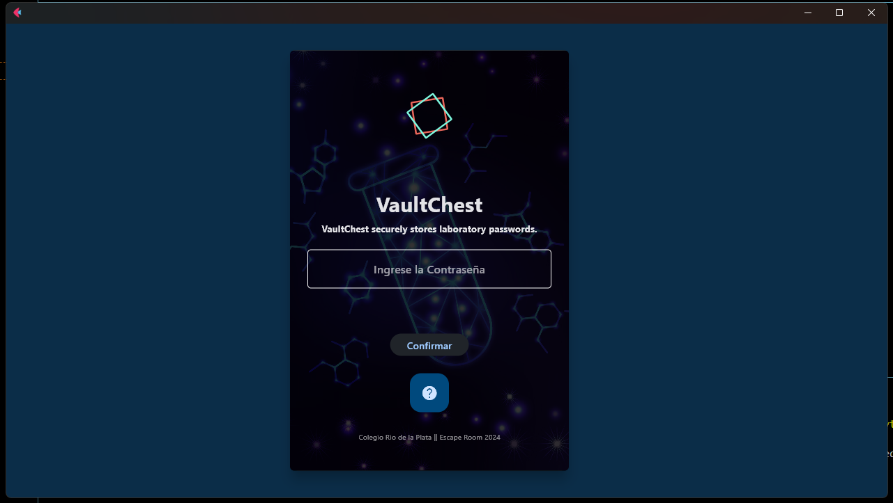

# App VaultChest

## Descripción
VaultChest es un programa diseñado para guardar de manera segura las contraseñas de laboratorio. Los usuarios pueden intentar ingresar la contraseña hasta tres veces. Si se equivocan más de tres veces, por motivos de seguridad, la computadora se reiniciará y deberán probar nuevamente.
(Se creo esta app para un desafio de escape room para el colegio Rio de La Plata)

### Requisitos
Version de python 3.11.4, necesita el framework Flet version 0.22.1. y Flutter version 3.22.2

~~~ (lenguaje en el que esta escrito)
pip install flet
~~~

---
### Fuentes
Se tomo como referencia la interfase creada por LineIndent
- [proyecto base](https://github.com/LineIndent/flet_projects).

---
